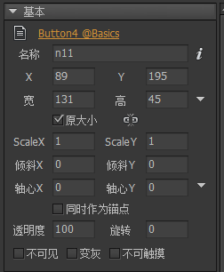
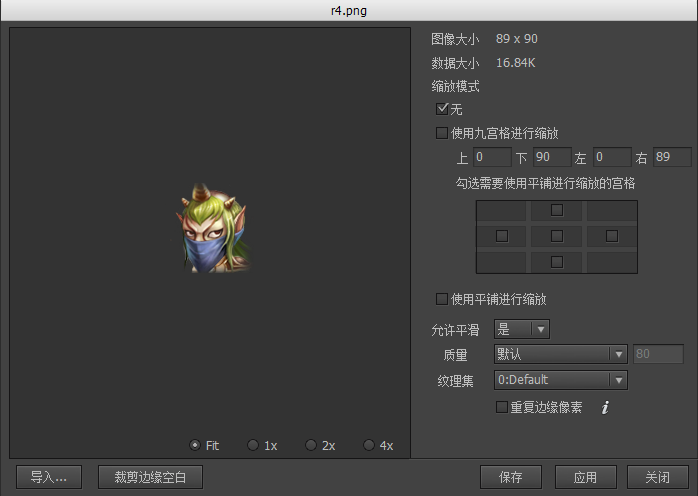
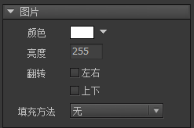
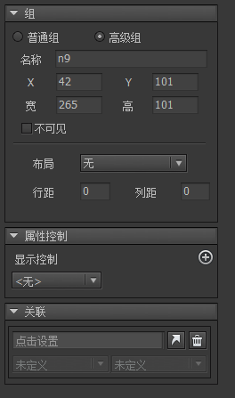
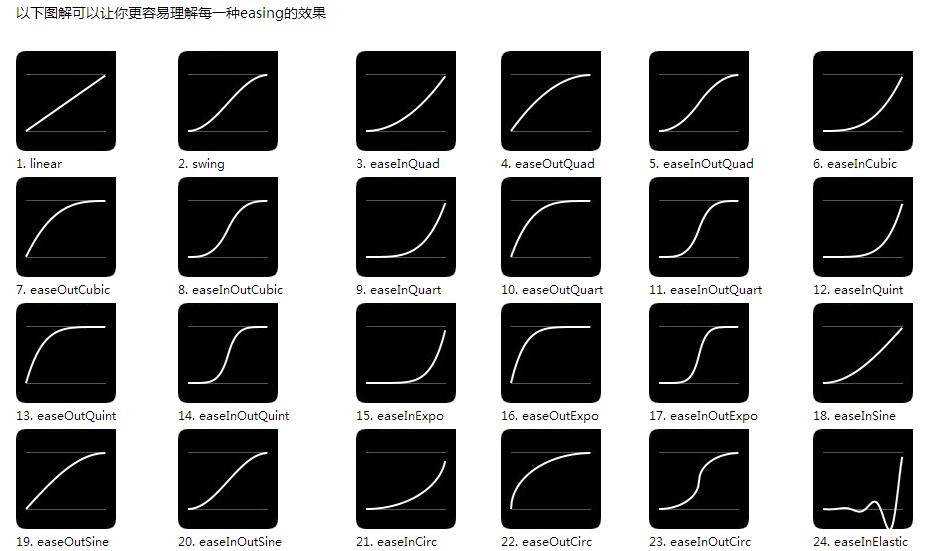
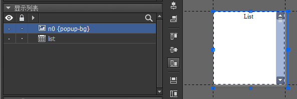

# 1. Guide
## 1.1. 元件 GObject


基础元件：图片、图形、动画、装载器、文本、富文本、组、组件。
组合型元件：标签、按钮、下拉框、滚动条、滑动条、进度条。
特殊元件：列表。
### 1.1.1. 获取元件的方式
定义元件的**名称**可以后期通过代码的GetChaild方法获取
### 1.1.2. 不建议
不建议在Unity 的开发中使用BlendMode和滤镜功能

## 1.2. 图片 GImage
### 1.2.1. 双击设置图片


**导入**：导入替换图片
**允许平滑**：如果开发的是像素游戏，建议关闭平滑

### 1.2.2. 不建议

不建议在Laya中使用颜色及亮度调整  

### 1.2.3. 代码
UIPackage.CreateObject("包名","图片名").asImage;

## 1.3. 动画 GMovieClip
## 1.4. 图形 GGraph
### 1.4.1. 注意
图形支持动态创建，动态创建需要设置大小，否则加载不出来
``` Typescript
GGraph holder = new GGraph();
holder.SetSize(100, 100);
holder.DrawRect(...);
aComponent.AddChild(holder);
```

## 1.5. 装载器 GLoader
### 1.5.1. 注意
图形支持动态创建，动态创建需要设置大小，否则加载不出来
``` Typescript
GLoader aLoader = new GLoader();
aLoader.SetSize(100,100);
aLoader.url = "ui://包名/图片名";
```

## 1.6. 字体
### 1.6.1. 文本模板
使用文本模板功能，可以轻松解决这种需求。只需要在编辑器放置一个文本控件，文本为“我的元宝：{jin=100}金{yin=200}银”，然后勾选“使用文本模板”即可。这样在编辑器中显示依然是“我的元宝：100金200银”，运行时程序员只需要执行以下的代码就可以更新数值：

``` Typescript
aTextField.SetVar("jin", "500").SetVar("yin", "500").FlushVars();
```
也可以批量设置：

``` Typescript
Dictionary<string, string> values;
values["jin"] = "500";
values["yin"] = "500";
//注意，这种方式不需要再调用FlushVars
aTextField.templateVars = values;
```

## 1.7. 富文本 GRichTextField
### 1.7.1. 注意
支持动态创建，必须设置大小

文本中的链接点击是冒泡事件，可以被其父物体侦听

## 1.8. 组 GGroup
### 1.8.1. 普通组
发布后不存在
### 1.8.2. 高级组
发布后依然继续存在
并且可以设置如下属性


### 1.8.3. 注意
高级组的运用有效可以加快效率，如其中的布局功能

**必须注意，对于没有布局的高级组，运行时是不会自动改变大小的，也就是无论组内的元素怎么变动，这种高级组的大小是不会自动改变的！**

## 1.9. 组件 GComponent
### 1.9.1. 点击穿透
//true表示不可穿透，false表示可穿透。
aComponent.opaque = false;

**这个特性在设计一些全屏界面时尤其要注意。例如一个主界面添加到舞台，并设置为全屏，如果不穿透的话，那么Stage.isTouchOnUI将一直返回true。**

### 1.9.2. 遮罩
#### 1.9.2.1. 矩形遮罩
设置为溢出隐藏就自带了矩形遮罩
#### 1.9.2.2. 自定义遮罩
透明度不为零的部分可见
#### 1.9.2.3. 注意
1、不显示的部分不接受点击测试
2、 编辑模式下，遮罩只有在预览模式下看到效果
3、 定义了遮罩的组件，其内部的元件永远无法和外部的元件合并Draw Call，因为他们有不同的材质属性。

#### 1.9.2.4. 代码注意
RemoveChild RemoveChildAt RemoveChildren 从容器内删除元件。当元件从显示对象中移出时，将不再占用显示资源。但元件从显示列表移出后，**只是不显示，并没有销毁，如果你没有保存这个对象的引用留待后续使用，或者没有调用对象的Dispose方法销毁对象，那么会产生内存泄露。**

## 1.10. 滚动容器
## 1.11. 控制器 Controller
动画曲线


### 1.11.1. 各种控制
#### 1.11.1.1. 显示控制
#### 1.11.1.2. 位置控制
#### 1.11.1.3. 颜色控制
#### 1.11.1.4. 大小控制
#### 1.11.1.5. 外观控制
#### 1.11.1.6. 文本控制
#### 1.11.1.7. 图标控制
#### 1.11.1.8. 动画控制

### 1.11.2. 联动
#### 1.11.2.1. 与按钮联动
#### 1.11.2.2. 与列表联动
#### 1.11.2.3. 与分页滚动联动
#### 1.11.2.4. 和下拉框联动

### 1.11.3. 侦听事件
#### 1.11.3.1. 切换控制器页面的事件
//Laya
c1.on(fairygui.Events.STATE_CHANGED, this, this.onChanged);
#### 1.11.3.2. 缓动属性播放完毕事件
//Laya
c1.on(fairygui.Events.GEAR_STOP, this, this.onGearStop);
### 1.11.4. 关闭所有控制器的缓动效果
//禁止所有控制器引起的缓动
GearBase.disableAllTweenEffect = true; 
c1.selectedIndex = 1;
//记住要复原
GearBase.disableAllTweenEffect = false;

## 1.12. 标签 GLabel

## 1.13. 下拉框 GComboBox
### 1.13.1. 先设计列表下弹的背景文件
需要按照如下格式并绑定到下拉框的**弹出组件**属性

### 1.13.2. 在页面中添加下拉框，并添加数据


## 1.14. 进度条 GProgressBar


## 1.15. 窗口组件 Window


