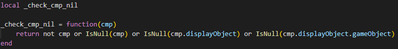

# 1. 疑问
## 1.1. 为什么有些主界面打开的方式会不同,即使效果是一样的
```lua
function BagManager.init()
    JumpUIManager.register("bag",
        function()
            GUIManager.show_ui("bag")
        end
    )
end

function BagManager.show_bag_ui()
   JumpUIManager.jump("bag")
end
```
是因为效果相同,而在需求改变时可以修改较少的代码实现功能?

## 1.2. 为什么有的代码要把local声明和初始化操作分开呢
